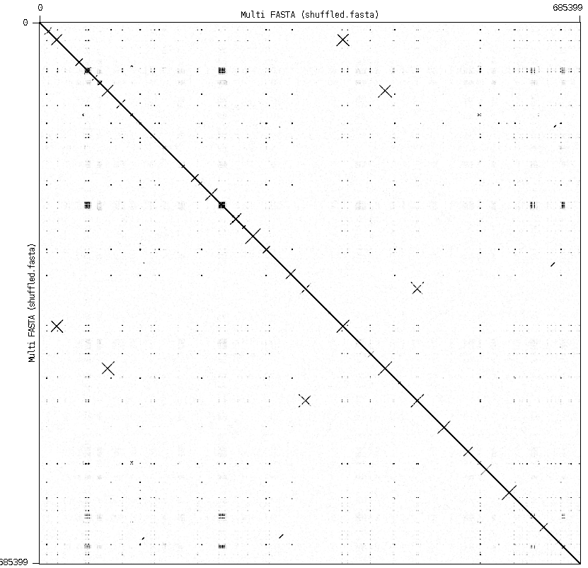

pbclip
------

A simple tool to fix PacBio fasta/q that was not properly split into subreads.
Pbclip detects the "strand switching" pattern, when the machine starts
to read the same sequence but in reverse direction, like in the dot-plot below.

  

License
-------

Distributed under a BSD license. See the [LICENSE file](LICENSE) for details.

Authors
-------

Mikhail Kolmogorov, UC San Diego
